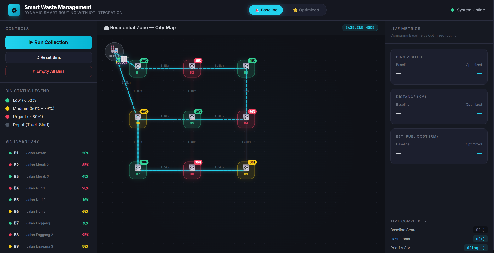

# 🚛 Smart Waste Management Dashboard

> An interactive, browser-based simulation that demonstrates how classical data structures and graph algorithms can reduce the operational cost of municipal waste collection.

🔗 **[Live Demo on Vercel](https://swmsd.vercel.app/)**

Click the link app above to see this project

**Course:** TEB1113 — Algorithm and Data Structure

**Deliverable:** Applied Data Structures Project

---

## 👥 Team Members

For privacy purposes, the team members and their student IDs are only provided in the report, considering this is a public repository and full names as well as student IDs are private information.

---

## 📖 Introduction

### The Problem

Conventional municipal waste collection operates on a **fixed, sequential route schedule**. A collection truck departs from the depot and visits *every* bin in a predetermined order (B1 → B2 → … → B9), regardless of whether those bins actually require servicing.

This creates measurable inefficiency:

- ⛽ **Wasted fuel** — the vehicle travels the full circuit even when most bins are nearly empty.
- ⏱️ **Wasted labour hours** — crews stop at bins that yield negligible volume.
- 🌍 **Avoidable emissions** — unnecessary distance translates directly into avoidable CO₂ output.
- 🗑️ **Poor responsiveness** — a bin that overflows mid-cycle still waits for its scheduled turn.

### Our Solution

This project proposes a **dynamic smart routing model**. Instead of servicing every bin, the system:

1. **Filters by urgency** — only bins at **≥ 80% capacity** are admitted into the collection set.
2. **Ranks by severity** — a Max-Heap orders urgent bins so the fullest are never overlooked.
3. **Optimises travel** — Dijkstra's shortest-path algorithm computes the minimum-distance road segment between consecutive stops.
4. **Quantifies the benefit** — the dashboard reports distance, bins serviced, and fuel cost (RM) side by side for both strategies, producing a live percentage saving.

The result is a transparent, verifiable comparison between the **Baseline (FIFO)** and **Optimised (Priority + Shortest Path)** approaches.

---

## ✨ Features & Visuals

| Feature | Description |
| :--- | :--- |
| 🖱️ **Click-to-Fill** | Left-click any bin on the map to incrementally raise its capacity and simulate accumulating waste. |
| 🖱️ **Right-Click to Empty** | Right-click a bin to reset it to 0%, simulating a manual collection event. |
| 📊 **Live Metrics Panel** | Real-time readout of bins visited, total distance (km), and fuel cost (RM) for each mode, plus a computed savings badge. |
| 🔀 **Mode Toggle** | Switch between **Baseline** and **Optimised** strategies and re-run the simulation to compare outcomes directly. |
| 🚚 **2D Truck Animation** | An animated truck traverses the rendered SVG route, pausing at each collection point to visualise the journey step by step. |
| 🗺️ **Road Network Overlay** | The weighted graph is drawn on the map, with the active route highlighted (red for baseline, green for optimised). |
| 🧪 **Console Unit Tests** | Every data structure self-verifies on page load — open DevTools (F12) → Console to inspect the assertions. |

### Screenshot



---

## 🚀 How to Run the Program

The project is built with **vanilla HTML, CSS, and JavaScript**. There is no build step, no package manager, and no external dependencies.

### Option A — Run Locally

1. Clone or download this repository:
   ```bash
   git clone https://github.com/your-username/Smart-Waste-Management-System.git
   ```
2. Open the project folder.
3. Double-click **`index.html`**, or open it in any modern browser (Chrome, Edge, Firefox, Safari).
4. Optionally press **F12** to open the console and review the data structure unit test output.

> 💡 No web server, compiler, or installation is required. The application runs entirely client-side.

### Option B — Run the Hosted Version

Visit the deployed build (click the link below):

🔗 **[Live Demo on Vercel](your-vercel-link-here)**

---

## 🧱 Data Structures Used

All four structures are implemented from scratch in **`js/datastructures.js`** — no external libraries are used.

### 1. Standard Queue — FIFO *(Baseline Strategy)*
A singly-linked-list queue. Because both ends are tracked (`first` and `last`), `enqueue` and `dequeue` run in **O(1)** with no array shifting. It models the baseline policy: service every bin strictly in the order it was scheduled.

### 2. Hash Table — O(1) Bin Lookup
A hash map using a **polynomial rolling hash** (base 31) with a prime table size of 53, resolving collisions via **separate chaining**. It provides **O(1) average-case** retrieval of any bin record by ID.

### 3. Priority Queue — Binary Max-Heap *(Urgency Ranking)*
A binary Max-Heap keyed on bin capacity, so the fullest bin always sits at the root. Both `enqueue` (bubble-up) and `dequeue` (sink-down) run in **O(log n)**. This drives the urgency ordering of the optimised strategy.

### 4. Graph + Dijkstra's Algorithm — Shortest Path
A **weighted, undirected adjacency list** where vertices are bins plus the depot and edge weights are road distances in kilometres. `dijkstra(start, end)` returns both the path and its total cost in **O((V + E) log V)**, backed by an internal **Min-Heap** priority queue.

> 🔍 **Note on the optimised route:** after the Max-Heap identifies the urgent set, the system applies a **greedy nearest-neighbour** traversal, invoking Dijkstra at each step to select the closest unvisited urgent bin. This is a well-established heuristic for the Travelling Salesman Problem, which is NP-hard and therefore impractical to solve exactly at scale.

---

## 📁 Project Structure

```
Smart-Waste-Management-System/
├── index.html              # Dashboard markup and layout
├── style.css               # Styling, map grid, and truck animation
├── js/
│   ├── datastructures.js   # Queue, HashTable, PriorityQueue, Graph + unit tests
│   ├── simulation.js       # Simulation engine, routing, metrics, animation
│   └── app.js              # Bin data, road network, rendering, event handlers
└── README.md
```

---

## 📐 Architectural Note: Baseline vs. Optimized Discrepancy

This section is provided for the benefit of evaluators, to pre-empt an apparent inconsistency between the written report and the source code.

### The Observation

In the **written report**, the Baseline Approach is described as relying purely on a **standard FIFO Queue**. Its logic is deliberately minimal: enqueue every bin in fixed order, dequeue them one at a time, service each in turn.

In the **source code** (`js/simulation.js`), however, the `baseline` branch of `runSimulation()` also instantiates a **`HashTable`** and invokes the **`Graph.dijkstra()`** method.

### The Explanation

**These additional structures are not part of the theoretical baseline algorithm.** They belong exclusively to the **Simulation and Visualisation Engine**, and serve two rendering-only purposes:

1. **`HashTable` — pixel coordinate retrieval.**
   To draw a bin or move the truck, the renderer must translate a logical node identifier (e.g. `"B4"`) into on-screen coordinates (`{ x, y }`). The hash table supplies this mapping in O(1) for both `renderRouteSVG()` and `animateTruck()`. It performs no route-selection work whatsoever.

2. **`Graph.dijkstra()` — physical path interpolation.**
   The FIFO queue determines only the *order of service* — for example, "next visit B3". It does not, and conceptually should not, describe how a vehicle physically travels between two points on a road network. Because the map is a graph rather than a plane of straight lines, the renderer calls Dijkstra to obtain the sequence of intermediate road nodes required to draw a geographically plausible polyline. Baseline distance is accumulated along these same real road segments purely so that both modes are measured on an identical, fair basis.

### Why This Distinction Matters

| Layer | Baseline Mode | Optimised Mode |
| :--- | :--- | :--- |
| **Selection logic** (which bins, in what order) | FIFO Queue only | Max-Heap + nearest-neighbour |
| **Filtering criterion** | None — all bins serviced | Capacity ≥ 80% |
| **Rendering support** (UI only) | HashTable, Dijkstra | HashTable, Dijkstra |

The separation to observe is between the **algorithm's decision-making logic** and the **user interface's rendering requirements**. **The baseline's decision-making remains a pure FIFO Queue, exactly as documented in the report**. Any use of the **hash table or shortest-path routine in that code path** exists solely **to render the physical truck path on screen and to measure both strategies against the same road network.**

Had the visualisation been omitted, the baseline implementation would consist of the FIFO Queue alone.

---

## 📊 Sample Results

Using the default nine-bin dataset, the optimised strategy typically services only the urgent subset and produces a substantially shorter route than the full sequential circuit. Exact figures depend on the bin capacities configured at run time and are reported live in the metrics panel, together with the resulting percentage saving in fuel cost (calculated at **RM 1.20 per km**).

---

## 📄 License

Prepared for academic assessment as part of coursework for TEB1113 — Algorithm and Data Structure.
